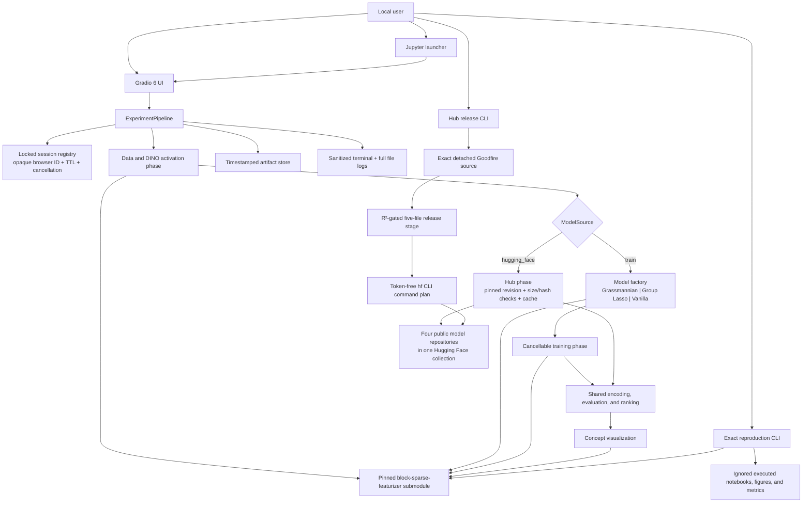

# Block-Sparse Featurizer Experiments

A local, GPU-capable workbench for exploring GoodFire’s Block-Sparse Featurizers (BSFs) for mechanistic interpretability of neural networks like image generation models, vision models, and LLMs.

BSFs shift the sparse coding unit from an individual direction, like Sparse Autoencoders (SAEs) have, to a block of directions spanning a learned low-dimensional subspace. 

In a toy setting, in that subspace they can recover or approximate a manifold within a learned block subspace that a conventional TopK SAE fragments across multiple atoms. 

Outside of toy settings, Goodfire reports evidence for coherent multidimensional variation within individual blocks, like a curve-orientation manifold in InceptionV1, lighting and shadow manifolds in DINOv3, or steerable concept manifolds in SDXL, that SAEs also fragment. ([Structuring Sparsity: Block-Sparse Featurizers Capture Visual Concept Manifolds](https://arxiv.org/abs/2606.25234))

The workbench exposes the Grassmannian, Group Lasso, and Vanilla block-sparse workflows through a Gradio UI. It can either train a BSF locally or reuse one of four published checkpoints from the [Block-Sparse Featurizers on DINOv3 Rabbits collection](https://huggingface.co/collections/BurnyCoder/block-sparse-featurizers-on-dinov3-rabbits-6a629047facccb1d34e808c2).

The DINO backbone is intentionally fixed to the validated [`facebook/dinov3-vitb16-pretrain-lvd1689m`](https://huggingface.co/facebook/dinov3-vitb16-pretrain-lvd1689m) checkpoint.


## Requirements

- Git with submodule support
- [`uv`](https://docs.astral.sh/uv/) and Python 3.12
- An NVIDIA CUDA GPU for practical DINOv3 extraction and exact reproduction
- A Hugging Face account with the DINOv3 model terms accepted
- A read token with access to the gated model; the public BSF checkpoints
  themselves can be downloaded without authentication

The lockfile pins the application to Gradio 6.20, PyTorch 2.13,
Transformers 5.14, torchvision 0.28, and the tested notebook/tooling stack.
Ordinary unit tests run offline and on CPU.

## Install

```bash
git clone --recurse-submodules \
  https://github.com/BurnyCoder/block-sparse-featurizer-experiments.git
cd block-sparse-featurizer-experiments
uv sync --frozen
```

If the repository was cloned without submodules:

```bash
git submodule update --init --recursive
uv sync --frozen
```

Create local configuration without committing it:

```bash
cp .env.example .env
chmod 600 .env
```

Set `HF_TOKEN` in `.env` after accepting the model terms. A read token is enough
for normal use; checkpoint maintainers need a fine-grained write token only
while publishing. Never paste the token into a command, notebook, issue, log, or
committed file. The application loads `.env` with `python-dotenv`, keeps only a
boolean “token available” flag in its configuration object, and redacts
token/password/secret/credential/authorization-shaped values from structured
events and tracebacks.

Available settings:

| Variable | Default | Meaning |
|---|---|---|
| `HF_TOKEN` | empty | gated-model read token |
| `BSF_HOST` | `127.0.0.1` | validated local host setting; launcher binds loopback |
| `BSF_PORT` | `7860` | local Gradio port |
| `BSF_OUTPUT_DIR` | `outputs/runs` | artifact/log root inside the repository's dedicated `outputs/` tree |
| `BSF_LOG_LEVEL` | `INFO` | Python log level |
| `BSF_MAX_UPLOAD_MB` | `512` | aggregate upload/checkpoint limit |
| `BSF_SESSION_TTL_SECONDS` | `3600` | inactive server-state lifetime |
| `BSF_DEVICE` | `auto` | `auto`, `cpu`, `cuda`, or `cuda:N` |

## Run the workbench

```bash
uv run bsf-ui
```

Training remains the default. To open the UI with a pretrained recipe selected:

```bash
uv run bsf-ui \
  --model-source hugging_face \
  --pretrained-recipe grassmannian_notebook
```

The accepted pretrained recipe values are `readme_quickstart`,
`grassmannian_notebook`, `group_lasso_notebook`, and `vanilla_notebook`.

Open [http://127.0.0.1:7860](http://127.0.0.1:7860). The server always launches
on `127.0.0.1` with `share=False`; only generated files beneath the configured
output directory may be downloaded. To prevent accidental filesystem exposure,
that directory must resolve to `outputs/` or one of its descendants and cannot
escape through a symlink. GPU-capable events share one serialized concurrency
group.

The fastest complete workflow is:

1. Choose a preset and either **Train with current controls** or **Hugging Face
   pretrained checkpoint**.
2. Click **Run Current Pipeline**.
3. Select ranked concepts and click **Render Concept Plot**.
4. Download the plot or export a result bundle.

The preset action intentionally updates controls without starting expensive
work, so settings can be inspected or reduced first. In Train mode the model and
training controls are applied normally. In Hugging Face mode the selected
recipe supplies the model configuration and BSF training is skipped, but the
input images still pass through DINO extraction, positional-mean subtraction,
and RMS scaling before shared encoding, evaluation, and ranking. Exact notebook
presets use 300 epochs and the full dataset when trained locally.

**Load from Hugging Face** loads only the selected BSF into the current session;
it does not load images or extract DINO activations. Hub errors stop the action
with no silent fallback to training.

### Every UI action

| Area | Controls and actions |
|---|---|
| Presets | **README Quickstart**, **Grassmannian Notebook**, **Group Lasso Notebook**, **Vanilla Notebook**, **Run Current Pipeline** |
| Data | **Check Environment**, **Load Rabbits**, **Load NPZ**, **Load Uploaded Images**, **Extract DINO Activations**, **Center & Scale**, extraction batch size |
| Model | model source, pretrained recipe, **Load from Hugging Face**, featurizer, group count, group size, L0, Group Lasso coefficient, target L0, gain, paper version, **Initialize Model** |
| Training | epochs, learning rate, batch size, SNR, log interval, seed, device, **Train**, **Stop Training**, live loss/R²/L0/dead groups and log |
| Features | **Encode Features**, **Reconstruct & Evaluate**, **Rank Concepts**, top-N count, **Select Top N**, searchable table containing every learned group |
| Visualization | concept multiselect, images per concept, image columns, overlay clip percentile, saturation, low-norm drop fraction, maximum points, point size, concept gap, **Render Concept Plot**, PNG/PDF downloads |
| Artifacts | **Save Checkpoint**, **Load Checkpoint**, **Export Results Bundle**, **Export Arrays**, full-log download, **Reset Session** |

`per_axis_rgb` is deliberately absent because the upstream implementation does
not use it as an effective control. PCA, decoder normalization, overlays, and
loss helpers remain internal parts of the higher-level actions.

### Data contracts and errors

- NPZ uploads must contain a nonempty `arr_0` array with shape `(N,H,W,3)` and
  dtype `uint8`; archives are opened with `allow_pickle=False`.
- Loose PNG, JPEG, and WebP files are EXIF-oriented, converted to RGB `uint8`,
  and must all have equal dimensions.
- DINO extraction must return `(N,196,768)` and preprocessing must produce a
  finite 14×14 patch grid.
- Group size cannot exceed 768; L0/target L0 cannot exceed the group count; a
  training batch cannot exceed the available token count.
- Visualization requires a nonempty unique concept selection and at least eight
  retained firing patches per selected concept.

Validation failures appear as actionable UI errors and are written to the
sanitized run log.

## Published checkpoints

The public collection groups four separate model repositories:

- [Grassmannian starter notebook](https://huggingface.co/BurnyCoder/bsf-dinov3-rabbits-grassmannian-notebook)
- [Group Lasso starter notebook](https://huggingface.co/BurnyCoder/bsf-dinov3-rabbits-group-lasso-notebook)
- [Vanilla starter notebook](https://huggingface.co/BurnyCoder/bsf-dinov3-rabbits-vanilla-notebook)
- [README Grassmannian quickstart](https://huggingface.co/BurnyCoder/bsf-dinov3-rabbits-readme-quickstart)

Each repository contains the hardened `checkpoint.pt`, a model card,
`manifest.json`, Goodfire's MIT terms, and the applicable DINOv3 license. The
manifest is the source of truth for that run's exact source/DINO revisions,
input hashes, unseeded initial state, environment, duration, and measured
metrics. Runtime identity and integrity values live in
`hub_phase.py`'s `CHECKPOINT_CATALOG`; no revision or metric is duplicated here.

The collection is a human-facing discovery surface. Runtime downloads resolve
each repository at the catalog's full commit SHA, preflight its size, reuse the
standard Hugging Face cache, and verify the local byte count and SHA-256 before
the existing strict checkpoint loader runs. The application never follows a
mutable branch or collection entry and never falls back to training after a Hub
failure.

### Maintainer release workflow

`hub_release.py` separates exact training and evidence collection from remote
publication. Prepare an unchanged detached checkout at the required upstream
commit:

```bash
git clone https://github.com/goodfire-ai/block-sparse-featurizer \
  outputs/upstream-goodfire-0bf2d9a
git -C outputs/upstream-goodfire-0bf2d9a checkout --detach \
  0bf2d9a6ae959452d57bc169374c8902135e0f02
```

`plan-train-all` prints four fresh-process command arrays. Run those commands
individually so every recipe has a clean interpreter, or invoke `train-one`
once per recipe:

```bash
uv run bsf-hub-release plan-train-all
uv run bsf-hub-release train-one grassmannian-notebook
uv run bsf-hub-release train-one group-lasso-notebook
uv run bsf-hub-release train-one vanilla-notebook
uv run bsf-hub-release train-one readme-quickstart
```

Only a run passing the R² gate receives a curated five-file `stage/` directory.
Before publication planning, the release tool reopens the checkpoint through the
strict v1 loader and cross-checks its architecture, feature width, size, and
SHA-256 against the manifest. Review the stage, confirm the local write token
without printing it, and generate the token-free `hf repos create`, `hf upload`,
and `hf collections add-item` commands:

```bash
uv run --env-file .env hf auth whoami
uv run bsf-hub-release plan-publish \
  grassmannian-notebook \
  --stage-dir /absolute/path/to/timestamped-run/stage
```

Execute the emitted `hf` commands with `.env` loaded, then record the final full
repository commit and checkpoint SHA-256 in `CHECKPOINT_CATALOG`; never substitute
`main` or `latest`. Repeat for all four repositories and verify the collection
with:

```bash
uv run --env-file .env hf collections info \
  BurnyCoder/block-sparse-featurizers-on-dinov3-rabbits-6a629047facccb1d34e808c2
```

## Reproduce upstream examples

Run the exact README quickstart, all three unchanged notebooks, or both:

```bash
uv run bsf-reproduce --target readme
uv run bsf-reproduce --target notebooks
uv run bsf-reproduce --target all
```

Preflight verifies CUDA, package versions, submodule assets/commit cleanliness,
and authenticated gated-model metadata access without reporting the token.
Useful diagnostic-only flags are `--allow-cpu`, `--skip-hf-check`,
`--output-dir`, and `--timeout`; use `uv run bsf-reproduce --help` for details.

Each timestamped output directory contains source hashes, full sanitized input
and output logs, metrics, and figures. Notebook targets additionally contain
executed notebook copies and HTML exports. The three source notebooks in the
submodule are never modified.

## Jupyter

Launch JupyterLab and open `notebooks/bsf_workbench.ipynb`:

```bash
uv run jupyter lab
```

The launcher imports the same `build_app` function as `bsf-ui`; it does not fork
or duplicate the pipeline. The notebook embeds the local UI and preserves the
same server-side session, output allowlist, upload limit, and single-worker
queue behavior.

## Scores

On the bundled 300-rabbit dataset:

| Workflow | Epochs | Final R² | Ranked concepts | Result |
|---|---:|---:|---:|---|
| README quickstart | 60 | 0.824 | 20 | passed |
| Grassmannian notebook | 300 | 0.802 | 20 | passed |
| Group Lasso notebook | 300 | 0.794 | 20 | passed |
| Vanilla notebook | 300 | 0.821 | 20 | passed |

All four workflows produce finite activations on a 14×14 patch grid, nonempty
ranked concepts, and nonblank figures. The README and GPU integration paths
also assert the raw `(300, 196, 768)` DINO shape; notebook summaries retain the
flattened `(58,800, 768)` training shape. Notebook runs save executed `.ipynb`
and HTML copies, while the README run saves its figure and metrics. All run
artifacts and complete sanitized logs live under the ignored `outputs/runs/`
directory. Results can vary slightly across hardware and software builds; the
automated gates require finite outputs (including loss histories where the
workflow emits them), at least one concept and plot, and R² ≥ 0.70.
These scores describe the reproduction suite; each unseeded Hub release records
its own authoritative measured metrics in that repository's `manifest.json`.

## Notes

The upstream repository is a Git submodule at
`vendor/block-sparse-featurizer`, pinned to merge commit `583bb538`, which adds
backward-compatible training progress and cooperative cancellation hooks. No
generated datasets, model weights, credentials, logs, or results are committed;
the submodule retains its small bundled rabbit fixture.

## Artifacts, state, and security

Large arrays and PyTorch models remain in a locked server-side session registry;
Gradio `State` receives only an opaque session ID. Reset, tab deletion, and TTL
expiry signal cancellation, release model references, and empty the CUDA cache.
Generated directories are timestamped and ignored by Git.

- Checkpoints contain only an allowlisted primitive model configuration and CPU
  `state_dict`; loading uses `torch.load(..., weights_only=True,
  map_location="cpu")` followed by exact schema validation. Both encoded upload
  size and ZIP member/uncompressed-storage budgets are enforced before PyTorch
  materializes tensor storage.
- Array exports reject object dtype and are safe to reopen with
  `np.load(..., allow_pickle=False)`.
- Result bundles include serializable settings, metrics, ranked concepts, and
  artifacts already produced in that session.
- The UI shows the last 200 sanitized log lines; **Download Full Log** returns
  the complete file without truncation.

Treat any uploaded checkpoint as resource-consuming even with restricted
unpickling; the configured upload limit also bounds its expanded storage.

## Architecture



`src/bsf_experiments/pipeline.py` is the single readable orchestration wrapper.
Each deeper phase lives in a focused module so UI, notebook, tests, and future
frontends reuse the same behavior.

## Tests and development

```bash
# Offline CPU suite (the default excludes gated GPU integration)
uv run pytest

# Fixed-backbone CUDA integration; requires .env access
uv run pytest -m gpu

# Static checks used by CI
uv run ruff check .
uv run ruff format --check .
```

The CPU suite covers input validation, all three featurizer factories and smoke
training, ranking, cancellation, session races, logging redaction, checkpoint
round trips, unsafe payload rejection, artifact exports, reproduction gates,
Hub catalog/download integrity, atomic Hub loading, release staging, and UI/CLI
adapters. GitHub Actions synchronizes `uv.lock` with recursive submodules and
runs only the offline suite; gated-model/GPU tests remain explicit local
integration tests.

When changing upstream research behavior, work in
`vendor/block-sparse-featurizer` first, merge its PR, then update and review the
outer submodule pointer. See `AGENTS.md` for the codebase-specific boundaries.

## Troubleshooting

- **403/gated model error:** accept the DINOv3 terms with the same Hugging Face
  account, create a read token, update `.env`, and click **Check Environment**.
- **Unknown Hub recipe:** upgrade to a repository revision whose trusted catalog
  includes that recipe; runtime selection never accepts arbitrary repository
  IDs, branches, or collection entries.
- **Hub checksum, size, or revision error:** do not bypass the catalog or enable
  training as an automatic fallback. Verify the repository/manifest and inspect
  the local cache with `uv run hf cache verify REPO_ID --revision COMMIT_SHA`;
  remove only the affected cached revision before one retry.
- **Hub unavailable:** retry later or explicitly select Train mode. A previously
  downloaded checkpoint can be reused from the standard cache, but DINO
  extraction may still require gated-model access.
- **CUDA unavailable:** confirm `uv run python -c "import torch; print(torch.cuda.is_available())"`
  returns `True` and that the installed PyTorch build matches the NVIDIA driver.
- **Out of memory:** reduce DINO extraction batch size, training batch size,
  groups, or images; reset the session before retrying.
- **Batch size error:** the trainer requires `1 <= batch_size <= N × 196` after
  DINO extraction.
- **Blank/failed concept plot:** rank and encode first, select concepts with at
  least eight firings, lower `drop_low_norm`, or choose another ranked group.
- **Stale browser session:** click **Reset Session** or reload; inactive server
  state is intentionally deleted after `BSF_SESSION_TTL_SECONDS`.
- **Port already in use:** set another local `BSF_PORT` in `.env` and restart.

## License and attribution

This repository orchestrates the vendored
[Goodfire block-sparse-featurizer project](https://github.com/goodfire-ai/block-sparse-featurizer);
consult it for the paper, authorship, citation, and MIT software terms.

Every published model card uses the custom `license: other` classification and
ships both `LICENSE-goodfire.txt` and `LICENSE-dinov3.md`. DINOv3's license
governs the backbone and associated materials. Review both included files before
using or redistributing a checkpoint; publication on the Hub does not replace
those terms.
